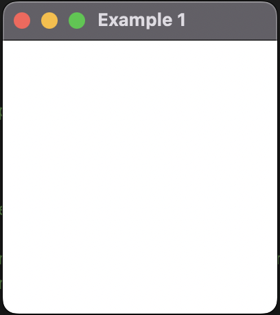
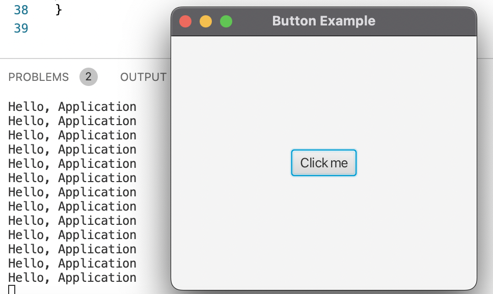

## Installing JavaFX on M1 Mac

To install and run JavaFX on Apple Silicon, JavaFX first must be installed from (https://gluonhq.com/services/javafx-support/). Once downloaded, open VSCode and create a new java project. This will have three folders:

1. `bin`
2. `lib`
3. `src`

The downloaded JAR files must be added to the lib folder. However, don't move them directly. Instead, open the `JAVA PROJECTS` pane at the bottom left corner. 

Then scroll to the bottom to `Referenced Libraries`. Click on `+` and add all the downloaded jar files. 

Next, create a folder named `hellofx`. Then, we create a `Main.java` file in the `hellofx` folder. In the `Main.java` file, put the following skeleton code:

```java
package hellofx;
import javafx.application.*;
import javafx.scene.*;
import javafx.stage.*;
import javafx.scene.layout.*;
public class Main extends Application{
    public static void main(String[] args){
        System.out.println("Launching FX Application");
        launch(args);
    }
    public void init(){
        System.out.println("Inside the init() method");
    }
    public void start(Stage myStage){
        System.out.println("Inside the start() method");
        myStage.setTitle("JavaFX skeleton");
        FlowPane rootNode = new FlowPane();
        Scene myScene = new Scene(rootNode, 300, 200);
        myStage.setScene(myScene);
        myStage.show();
    }
    public void stop(){
        System.out.println("Inside the stop() method");
    }
}
```

Then, go to the **run and debug** pane and select the option for creating a `launch.json` file. This file would look like:

```json
{
    "version": "0.2.0",
    "configurations": [
        {
            "type": "java",
            "name": "Launch App",
            "request": "launch",
            "mainClass": "hellofx.Main",
            "vmArgs": "--module-path ~/Downloads/javafx-sdk-18/lib/ --add-modules javafx.controls,javafx.fxml"
        }
    ]
}
```

**Note**: I have not found any use for the `.dylib` files so far.

## JavaFX Notes

Some basic terminology:
1. **Stage**: Central metaphor employed by JavaFX. A stage conttains a *scene*. All JavaFX applications have access to one stage called the **_primary stage_**. For most applications, the primary stage will be the only stage required.
2. **Scene**: A stage defines a space and a scene defines what goes into that space. The Scene is a contain for the items that comprise the scene.
3. **Nodes**: The individual elements of a scene are called nodes.
4. **Parent Node**: A node with a child. Also called a *branch node*.
5. **Terminal Node**: A node without children

## A Skeleton Application

```java
import javafx.application.*;
import javafx.stage.*;
import javafx.scene.*;
import javafx.scene.layout.*;

public static void main(String[] args){
    launch(args);
}
public void init(){}
public void stop(){}
public void start(Stage newStage){
    newStage.setTitle("Example 1");
    FlowPane rootNode = new FlowPane();
    Scene newScene = new Scene(rootNode, 200, 200);
    newStage.setScene(newScene);
    newStage.show();
}
```

<table>
<tr>
<td>

```java
import javafx.application.*;
import javafx.stage.*;
import javafx.scene.*;
import javafx.scene.layout.*;

public static void main(String[] args){
    launch(args);
}
public void init(){}
public void stop(){}
public void start(Stage newStage){
    newStage.setTitle("Example 1");
    FlowPane rootNode = new FlowPane();
    Scene newScene = new Scene(rootNode, 200, 200);
    newStage.setScene(newScene);
    newStage.show();
}
```

</td>

<td>
</img>
</td>
</tr>
</table>


Note here that while the `init()` and `stop()` methods are important, they are not *necessary* i.e. the program compiles without them too.

Now, we can move on to an application that uses a single button to print "Hello, Application":

<table>
<tr>
<td>

```java
import javafx.application.Application; // base javafx application class
import javafx.stage.Stage; // base stage class
import javafx.scene.Scene; // base scene class
import javafx.scene.control.Button; // adding button
import javafx.scene.layout.StackPane; // adding layout
import javafx.event.EventHandler; // is a collection class for events
import javafx.event.ActionEvent; // creating the actual even handler

class Main extends Application{
    public static void main(String[] args){
        launch(args);
    }
    public void start(Stage primaryStage){
        Button btn = new Button();
        btn.setText("Click me");
        btn.setOnAction(new EventHandler<ActionEvent>(){
            @Override
            public void handle(ActionEvent event){
                System.out.println("Hello, Application");
            }
        }); // inline event handler
        StackPane root = new StackPane();
        root.getChildren().add(btn);
        Scene primaryScene = new Scene(root, 300, 250);
        primaryStage.setTitle("Button Example"); 
        primaryStage.setScene(primaryScene);
        
    }
}

```

</td>
<td>
The output comes out to be: <br>
</img>
</td>
</tr>
</table>

Next, we try to create a simple form:

<table>
<tr>
<td>

```java
import javafx.application.Application;
import javafx.scene.Scene;
import javafx.stage.*;
import javafx.scene.control.*;
import javafx.scene.layout.*;
import javafx.scene.text.*;

public class Main extends Application{
    public static void main(String[] args){
        launch(args);
    }
    public void start(Stage primaryStage){
        GridPane grid = new GridPane();
        grid.setAlignment(Pos.CENTER);
        grid.setHgap(10);
        grid.setVgap(10);
        grid.setPadding(new Insets(25, 25, 25, 25));
        Scene primaryScene = new Scene(grid, 300, 275);
        Text sceneTitle = new Text("Welcome");
        Label userText = new Label("Username");
        Label passText = new Label("Password");
        TextField userField = new TextField();
        PasswordField passField = new PasswordField();
        sceneTitle.setFont("Verdana", FontWeight.EXTRA_BOLD, 20);
        grid.add(sceneTitle, 0, 0, 2, 1); // (col, row, colspan, rowspan)
        grid.add(userText, 0, 1);
        grid.add(passText, 0, 2);
        grid.add(userField, 1, 1);
        grid.add(passField, 1, 2);
        primaryStage.setScene(primaryScene);
        primaryStage.setTitle("Form");
        primaryStage.show();
    }
}
```

</td>
<td>
</img>
</td>
</tr>
</table>

## Adding a Sign In Button


<table>
<tr>
<td>

```java
import javafx.application.Application;
import javafx.event.ActionEvent;
import javafx.event.EventHandler;
import javafx.geometry.Insets;
import javafx.geometry.Pos;
import javafx.scene.Scene;
import javafx.scene.control.*;
import javafx.scene.layout.*;
import javafx.scene.text.*;
import javafx.stage.Stage;

public class Main extends Application{
    public static void main(String[] args){
        launch(args);
    }
    public void start(Stage primaryStage){
        GridPane grid = new GridPane();
        grid.setAlignment(Pos.CENTER);
        grid.setHgap(10);
        grid.setVgap(10);
        grid.setPadding(new Insets(25, 25, 25, 25));
        Scene primaryScene = new Scene(grid, 300, 275);
        Text sceneTitle = new Text("Welcome");
        Label userText = new Label("Username");
        Label passText = new Label("Password");
        TextField userField = new TextField();
        PasswordField passField = new PasswordField();
        sceneTitle.setFont(Font.font("Verdana", FontWeight.EXTRA_BOLD, 20));
        grid.add(sceneTitle, 0, 0, 2, 1);
        grid.add(userText, 0, 1);
        grid.add(passText, 0, 2);
        grid.add(userField, 1, 1);
        grid.add(passField, 1, 2);
        //grid.setGridLinesVisible(true);
        Button btn = new Button("Sign In");
        HBox hbBtn = new HBox(10); // spacing between horizontal elements
        
        hbBtn.setAlignment(Pos.BOTTOM_RIGHT);
        hbBtn.getChildren().add(btn);
        grid.add(hbBtn, 1, 4);
        primaryStage.setScene(primaryScene);
        primaryStage.setTitle("Form");
        primaryStage.show();
    }
}
```

</td>
<td>
</img>
</td>
</tr>
</table>

However, this sign in button is not functional. To add some functionality, we need event handling like so:

<table>
<tr>
<td>

```java
import javafx.application.Application;
import javafx.event.ActionEvent;
import javafx.event.EventHandler;
import javafx.geometry.Insets;
import javafx.geometry.Pos;
import javafx.scene.Scene;
import javafx.scene.control.*;
import javafx.scene.layout.*;
import javafx.scene.paint.Color;
import javafx.scene.text.*;
import javafx.stage.Stage;

public class Main extends Application{
    public static void main(String[] args){
        launch(args);
    }
    public void start(Stage primaryStage){
        GridPane grid = new GridPane();
        grid.setAlignment(Pos.CENTER);
        grid.setHgap(10);
        grid.setVgap(10);
        grid.setPadding(new Insets(25, 25, 25, 25));
        Scene primaryScene = new Scene(grid, 300, 275);
        Text sceneTitle = new Text("Welcome");
        Label userText = new Label("Username");
        Label passText = new Label("Password");
        TextField userField = new TextField();
        PasswordField passField = new PasswordField();
        sceneTitle.setFont(Font.font("Verdana", FontWeight.EXTRA_BOLD, 20));
        grid.add(sceneTitle, 0, 0, 2, 1);
        grid.add(userText, 0, 1);
        grid.add(passText, 0, 2);
        grid.add(userField, 1, 1);
        grid.add(passField, 1, 2);
        //grid.setGridLinesVisible(true);
        Button btn = new Button("Sign In");
        HBox hbBtn = new HBox(10); // spacing between horizontal elements
        hbBtn.setAlignment(Pos.BOTTOM_RIGHT);
        hbBtn.getChildren().add(btn);
        grid.add(hbBtn, 1, 4);
        final Text actiontarget = new Text();
        grid.add(actiontarget, 1, 6);
        btn.setOnAction(new EventHandler<ActionEvent>(){
            @Override
            public void handle(ActionEvent e){
                actiontarget.setFill(Color.FIREBRICK);
                actiontarget.setText("Sign in button pressed");
            }
        });
        primaryStage.setScene(primaryScene);
        primaryStage.setTitle("Form");
        primaryStage.show();
    }
}
```

</td>
<td>
</img>
</img>
</td>
</tr>
</table>


